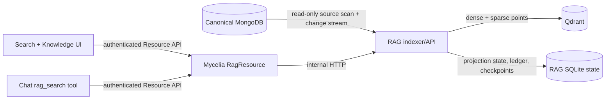

# Qdrant RAG projection

Mycelia keeps MongoDB as the canonical database. Qdrant is an additional,
disposable search projection: it may contain normalized text, chunk metadata,
dense vectors, and sparse BM25 vectors, but it is never the authoritative copy
of a message, transcription, object, or media description.

The first integration deliberately excludes Mem0, graph memory, automatic
answer generation, and canonical writes. Those can consume this retrieval
contract later without changing who owns the original data.

## Architecture



The RAG stack is a separate Compose project. Starting, stopping, rebuilding, or
removing its containers does not restart the main Mycelia MongoDB, Redis,
backend, frontend, or nginx services.

## Local ports and storage

| Surface | Container port | Default host port | Purpose |
| --- | ---: | ---: | --- |
| RAG API | 8091 | 48091 | Health, status, search, inspection, and index controls |
| Qdrant REST/dashboard | 6333 | 46333 | Database API and `/dashboard` |
| Qdrant gRPC | 6334 | 46334 | Optional direct diagnostics |

The defaults do not overlap Mycelia's `4433`, `3210`, or MongoDB's `27017`.
Qdrant and the RAG API bind to `127.0.0.1` by default. Persistent state lives
in three volumes owned by the `mycelia-rag` Compose project:

- `rag_qdrant_data`: vector collections and payload indexes;
- `rag_state`: the SQLite projection catalog, source ledger, and checkpoints;
- `rag_model_cache`: local FastEmbed model files.

`docker compose down` preserves all three volumes. Do not use `down -v` unless
discarding and rebuilding the complete vector projection is intentional.

## Retrieval model

The default dense model is
`sentence-transformers/paraphrase-multilingual-MiniLM-L12-v2` (384 dimensions)
so English and Russian text share one lightweight local embedding space. The
sparse leg uses `Qdrant/bm25`. Hybrid search asks Qdrant for dense and sparse
candidates and combines their ranks with Reciprocal Rank Fusion (RRF).

Model choice, dimensions, chunking parameters, and adapter schema versions are
fingerprint inputs. Changing any of them makes the active generation
incompatible: search and incremental mutation stop until a blue/green rebuild
activates a matching generation, so embedding spaces are never mixed.

The initial adapters cover:

| Kind | Canonical collection | Indexed evidence |
| --- | --- | --- |
| `transcription` | `transcriptions` | Recorded speech text and time/source provenance |
| `message` | `messages` | Message text, platform, chat, and timestamp provenance |
| `object` | `objects` | Object title, fields, summaries, and time provenance |
| `media_visual_description` | `media_visual_descriptions` | Active visual descriptions and asset/run provenance |

Each Qdrant point has a stable source reference, chunk index, content hash, and
canonical URI. Search results are evidence snapshots with links back to
Mycelia; vector similarity alone is not a factual claim. Exact counts, current
job state, relationship traversal, and all writes must continue to use the
canonical resources.

## Product acceptance matrix

The product contract separates semantic discovery from canonical facts. RAG
may improve recall and rank candidate evidence, but it must not infer a date,
speaker, platform, relationship, object type, task status, or merge decision.
Those values come from canonical MongoDB records and the object graph.

The implementation states below are intentionally explicit:

- **Current** means the behavior is present in this standalone module now.
- **P0 next** means it is required before chat may treat RAG as the normal path
  for fact-finding questions.
- **P1/P2 planned** means the retrieval boundary is defined here, but the
  end-to-end workflow is not yet implemented and must not be advertised as
  available.

| Priority/state | User task | RAG responsibility | Deterministic authority |
| --- | --- | --- | --- |
| Current | Search indexed Mycelia text | Hybrid, semantic-only, or lexical-only ranking across transcriptions, messages, objects, and active media descriptions | Qdrant applies typed candidate filters, then MongoDB revalidates current source revision, date/type, exact source, message platform, and `messages.senderId` before evidence is returned |
| Current P0 evidence / P0 answer next | Answer from several conversations and messages | Over-fetch and produce a deterministic compact evidence set capped per chat, recording, or canonical source | Every timed conversation/message item has `evidenceId`, current source hash, content hash, exact time, ID, and link; claim-level citation validation in the saved chat answer remains P0 next |
| P0 next | “What did I say about X in May?” | Recall paraphrases, multiple languages, and likely ASR variants | Message sender filtering is current; voice identity needs a speaker-aligned ASR/diarization projection resolved from timed canonical annotations, not a whole-transcription label |
| P1 planned | “Everything important about this person/project” | Expand retrieval with known aliases and find indirect or similar mentions | Object type, aliases selected for expansion, and relationships come from the object graph; vector similarity cannot create a relationship |
| P1 planned | “How did my opinion change?” | Retrieve relevant fragments across a long interval | The final timeline is sorted by canonical event time with a stable tie-breaker, never by vector score; missing/ambiguous time remains explicit |
| P1 planned | Decisions, promises, and contradictions | Raise recall for the original discussions and surface candidates for comparison | Promise/task/decision state is stored and read structurally; retrieval or an LLM cannot silently change that state |
| P2 planned | Related memories / similar conversations | Offer similarity-based discovery | Results are labelled as similarity candidates, not facts, relationships, or evidence of causality |
| P2 planned | Possible duplicate people and objects | Produce a review shortlist | Merge requires canonical alias/object-graph checks and explicit confirmation; RAG never merges objects |
| P2 planned | Context-assisted extraction | Supply prior aliases and cited context before entity extraction | Extracted output is validated against a schema and saved with model/pipeline version, source references, and provenance |

### P0 deterministic retrieval contract

P0 search uses a two-stage boundary. Qdrant first applies projection-side
payload filters and ranks an over-fetched candidate set. The RAG source
repository then reads the referenced MongoDB records, applies the same typed
constraints to canonical fields, drops deleted or no-longer-matching records,
re-runs the active chunker, verifies content/source hashes, and returns that
canonical excerpt plus provenance. A Qdrant payload is therefore a
search accelerator, not sufficient proof that a filter still matches.

The current P0 evidence API keeps these values outside the embedded query text:

- an inclusive `start`/`end` interval with documented interval-overlap
  semantics;
- source kinds plus optional exact `(collection, sourceId)` identities;
- exact message sender IDs from `messages.senderId` and exact platform
  identifiers from canonical message metadata;
- a deterministic per-source cap for evidence diversity.

Voice speaker filtering remains P0 next. `transcriptions` do not own speaker
identity: resolved identity belongs to timed active diarization segments with
manual annotations. The next projection must align ASR segment times with that
canonical resolver and expose a namespaced `voice_profile` predicate. A
document-level `speakerIds` shortcut or legacy `matched_speaker` lookup would
misattribute text in multi-speaker recordings and is explicitly forbidden.

Platform values are exact identifiers, never semantic matches. Free-form speaker
names must not be accepted as an authoritative filter. When alias/“me” resolution
is added, ambiguity must produce a typed ambiguity/no-match result instead of a
best semantic guess. When canonical
rehydration cannot be completed, the response is unavailable/degraded rather
than an authoritative empty result.

Evidence diversity is a deterministic post-ranking step. It caps chunks per
message chat, source recording, or canonical object/media source and then fills
remaining slots in fused-score order, using
`collection`, source ID, chunk index, and point ID as stable tie-breakers. It
must not lower filter strictness or invent coverage: if only one source
matches, the response says so.

The RAG API returns evidence, not an uncited factual answer. Chat or another
answer layer may synthesize across that evidence only while retaining a
claim-to-source mapping. At minimum each evidence item includes raw/canonical
source identity, exact time bounds for messages/transcriptions, message platform
and sender when applicable, canonical link, projection ID, chunk index, and
content hash/revision needed to detect a stale citation. Voice speaker identity
is added only by the P0-next speaker-aligned projection described above. Message
links include the exact `messageId`; both chat surfaces highlight the target and
show an explicit unavailable state for deleted, malformed, or wrong-chat
references. For multi-range objects, `start`/`end` are only a candidate envelope:
MongoDB checks each canonical `timeRanges` interval, and the source revision
covers the complete interval list. The response also exposes candidate,
verified, returned, distinct-source, and distinct-context counts so the cap is
visible rather than a hidden ranking heuristic.

### Acceptance tests by use case

All tests use fixed MongoDB fixtures and a disposable Qdrant projection. They
assert both recall and the deterministic negative cases; a high similarity
score never overrides a failed canonical constraint.

| Case | Minimum acceptance test |
| --- | --- |
| Current retrieval (implemented) | Hybrid, semantic, and lexical modes return schema-valid provenance; kind/time overlap filters exclude non-matching points; degraded freshness remains visible |
| P0 message filters (implemented) | High-scoring controls with the wrong date, kind, exact source, platform, or `messages.senderId` are excluded after MongoDB revalidation |
| P0 stale projection (implemented) | Update or delete a canonical source without updating the test projection. Search drops the stale hit, reports the revalidation degradation, and never quotes the stale payload as raw evidence |
| P0 multi-source evidence (implemented) | Seed many relevant messages in one chat and relevant messages in at least two others. The result respects the context cap, remains deterministic, and preserves evidence/source revision metadata |
| P0 voice topic-in-period (next) | Seed Russian/English paraphrases and an ASR-damaged mention, plus high-scoring controls with the wrong month and resolved voice profile. Only time-aligned speech by the requested canonical profile is returned |
| P0 chat grounding | For a multi-claim answer, every factual claim maps to at least one returned evidence ID; an uncited claim or a citation whose revision/content hash no longer matches fails the grounding check |
| P1 person/project | Aliases and indirect mentions improve recall, while asserted object types and relationships exactly match the canonical object graph; an embedding-only relationship candidate is rejected |
| P1 opinion timeline | Retrieved evidence is ordered by canonical time with deterministic ties, irrespective of similarity rank; missing timestamps are separated or explicitly marked |
| P1 promises/decisions | Retrieval finds paraphrased and conflicting discussions, but status in the response exactly matches the structural promise/task/decision record |
| P2 related/duplicates | Similar items are returned only as candidates; no relationship or merge write occurs without graph/alias validation and explicit confirmation |
| P2 extraction context | Alias context is source-cited, and the saved extraction contains schema version, pipeline/model version, input source references, and provenance |

The future authorization/read-only migration reruns the same suite with owner A
and owner B fixtures. In addition to the migration-specific tests below, every
search/evidence case must prove that over-fetching, canonical rehydration, and
diversity cannot leak another owner's raw content or metadata.

## Projection lifecycle

The status API and **Settings → Knowledge index** expose both the active
generation and any build in progress.

The canonical-evidence payload (`sourceHash`, platform/sender, and context
group) is part of the projection fingerprint. An older generation is therefore
reported incompatible after this upgrade and requires an explicit blue/green
rebuild; the service never mixes old payloads into the new contract.

```text
empty -> building -> catching_up -> ready/active
                 \-> error
active + pause flag -> paused overlay -> active
active + rebuild -> building(new) -> active(new) + superseded(old)
```

- **empty**: no activated projection exists;
- **building**: a keyset backfill is chunking and embedding canonical sources;
- **catching_up**: the backfill is complete and queued/change-stream updates
  plus a reconcile pass are closing the freshness gap;
- **ready / active**: search uses this generation;
- **paused**: an orthogonal flag overlays the current lifecycle; the active
  generation remains searchable and index/cutover work waits at safe gates;
- **error**: the attempted generation failed. A previously active generation
  remains active;
- **superseded**: a former active generation retained for inspection/rollback.

Rebuild is blue/green. It creates a generation-specific Qdrant collection and
does not clear the active collection in place. Activation changes the durable
SQLite pointer only after backfill, catch-up, and validation finish. Old
collections are not automatically deleted.

Status includes:

- projection/generation ID, collection name, and full fingerprint inputs;
- build start, source high-watermark, activation, checkpoint, and reconcile
  timestamps;
- processed source and indexed/deleted chunk counts;
- counts and latest event per source adapter;
- current phase, lag estimate, last error, and recent operation information;
- Qdrant collection point counts and supported search modes.

## Incremental correctness

The indexer uses four complementary mechanisms:

1. A bounded `_id` cursor backfill builds a deterministic source projection.
2. MongoDB change streams observe inserts, replacements, updates, and deletes.
   Resume tokens/checkpoints are persisted in SQLite, never only in memory or
   Redis Pub/Sub.
3. The SQLite ledger records every canonical source document, including
   zero-chunk documents, and maps indexed sources to point IDs/content hashes.
   Counts remain idempotent across replay, and a delete removes all chunks even
   when MongoDB supplies only the deleted `_id`.
4. Periodic reconcile compares canonical source hashes with the ledger, repairs
   missed updates, and tombstones sources no longer present.

Before each rebuild, the indexer captures a database-level change-stream resume
token. After the full comparison it replays every event since that boundary
into the candidate, persists the new durable token, and only then activates the
candidate. A mutation lock prevents the active change-stream consumer from
racing the final reconcile/alias switch. Interrupted operations are marked as
failed on restart, cancelled work normalizes transient lifecycle state, and the
SQLite active pointer repairs the Qdrant alias. Collection drop, rename, and
invalidation events persist a repair boundary before scheduling reconcile, so
a poison event cannot loop forever.

All upserts and deletes are idempotent. A process crash may repeat a bounded
batch but must not duplicate points. Search remains on the previous active
generation while a rebuild is incomplete.

## Start the isolated stack

Create a local configuration without editing the main `.env`:

```bash
cp .env.rag.example .env.rag.local
```

Review `RAG_MONGO_URL`. The transitional default reads the MongoDB port exposed
by the main local stack. If MongoDB requires credentials, put them only in the
ignored `.env.rag.local` file.

Build and start only Qdrant and the RAG service:

```bash
docker compose \
  --env-file .env.rag.local \
  -f docker-compose.rag.yml \
  build rag

docker compose \
  --env-file .env.rag.local \
  -f docker-compose.rag.yml \
  up -d
```

Observe states separately:

```bash
docker compose \
  --env-file .env.rag.local \
  -f docker-compose.rag.yml \
  ps

docker compose \
  --env-file .env.rag.local \
  -f docker-compose.rag.yml \
  logs -f rag qdrant

curl -fsS http://127.0.0.1:48091/health
curl -fsS http://127.0.0.1:48091/ready
curl -fsS http://127.0.0.1:48091/v1/status
```

`/health` proves only that the API process is alive. `/ready` additionally
requires a compatible active Qdrant collection, a repaired alias, and—when the
future gate is enabled—a verified read-only Mongo principal. It may still
return 200 while a replacement candidate is building; inspect `/v1/status` for
both generations and freshness state.

Qdrant's own local dashboard is available at
`http://127.0.0.1:46333/dashboard`. Prefer Mycelia's Knowledge page for normal
operations because it explains projection state and preserves the blue/green
control contract.

## Connect Mycelia

The backend talks to the RAG API through `RagResource`; the browser never calls
port 48091 or Qdrant directly.

For a backend running on the host:

```dotenv
RAG_URL=http://127.0.0.1:48091
```

For the normal Docker backend, use:

```dotenv
RAG_URL=http://host.docker.internal:48091
```

Docker Desktop may require the standalone API to be published beyond host
loopback. If `host.docker.internal` cannot reach the default binding, set
`RAG_API_BIND=0.0.0.0` only in `.env.rag.local`, set
`RAG_AUTH_MODE=internal_token`, generate a strong `RAG_INTERNAL_TOKEN`, and
copy the same token to the main ignored `.env` as `RAG_INTERNAL_TOKEN`.
Do not expose an unauthenticated RAG API containing personal text to a LAN.

After changing the main `.env`, recreate only the backend and restart nginx as
documented in `DEVELOPMENT.md`. Qdrant/RAG remain in their separate project.

## Product surfaces

- **Search** (`/search`) runs hybrid, semantic-only, or lexical-only queries,
  applies source/time filters, displays scores and projection freshness, and
  links each result to canonical Mycelia data.
- **Settings → Knowledge index** (`/settings/knowledge`) shows lifecycle,
  fingerprint, progress, per-source counts, checkpoints, errors, and recent
  chunks. It exposes rebuild, reconcile, pause, and resume controls.
- **Chat** exposes only the read-only `rag_search` tool. Index lifecycle
  controls are never LLM tools. The chat tool is absent when `RAG_URL` is blank,
  and its results include projection/checkpoint freshness.

### Control semantics

- **Reconcile now** scans for drift in the active generation. It is safe and
  idempotent.
- **Pause updates** stops background incremental processing; search remains
  available and visibly stale.
- **Resume updates** restarts catch-up from the durable checkpoint; the bounded
  periodic reconcile remains the correctness backstop.
- **Snapshot/manual mode** (`RAG_ENABLE_BACKGROUND=false`) leaves search
  available but reports `checkpointState=disabled`, null lag, and a degraded
  freshness warning until operators reconcile or rebuild explicitly.
- **Rebuild** creates a new generation. The UI requires confirmation and shows
  both build and active state until activation.

## Deferred authorization and read-only database migration

The first local milestone runs in explicit `RAG_AUTH_MODE=none` and records that
mode in status. The code must still keep source access behind a repository that
has no canonical write methods. This is transitional, not the final security
model.

The later migration is independently reviewable:

1. create a dedicated MongoDB user/role limited to the required collections,
   `find`, collection metadata needed by bounded scans, and change streams;
2. set `RAG_REQUIRE_READONLY_MONGO=true` and refuse readiness when the
   credential/privilege contract cannot be established;
3. derive owner scope from backend authentication, sign it for the internal
   RAG call, store owner in every Qdrant payload, and add a mandatory Qdrant
   filter before retrieval;
4. limit rebuild/reconcile/pause/resume to administrative policy actions;
5. migrate/backfill owner metadata into a new projection generation and switch
   atomically after cross-owner leakage tests pass.

Required migration tests include: canonical writes rejected by MongoDB,
cross-owner search returning zero results, UI-supplied owner fields ignored,
chat tools executing through ResourceManager policy checks, deletes removing
only the authorized owner's points, and rollback retaining the old active
generation.

## Deferred integrations

Mem0/OpenMemory, graph memory, rerankers, and answer synthesis remain separate
future integrations. They may consume cited RAG results or maintain their own
rebuildable projections, but they must not become canonical storage or bypass
the source/owner filters above.
