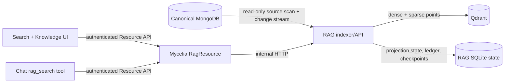

# Qdrant RAG projection

Mycelia keeps MongoDB as the canonical database. Qdrant is an additional,
disposable search projection: it may contain normalized text, chunk metadata,
dense vectors, and sparse BM25 vectors, but it is never the authoritative copy
of a message, transcription, object, or media description.

The first integration deliberately excludes Mem0, graph memory, automatic
answer generation, and canonical writes. Those can consume this retrieval
contract later without changing who owns the original data.

## Architecture



The RAG stack is a separate Compose project. Starting, stopping, rebuilding, or
removing its containers does not restart the main Mycelia MongoDB, Redis,
backend, frontend, or nginx services.

## Local ports and storage

| Surface | Container port | Default host port | Purpose |
| --- | ---: | ---: | --- |
| RAG API | 8091 | 48091 | Health, status, search, inspection, and index controls |
| Qdrant REST/dashboard | 6333 | 46333 | Database API and `/dashboard` |
| Qdrant gRPC | 6334 | 46334 | Optional direct diagnostics |

The defaults do not overlap Mycelia's `4433`, `3210`, or MongoDB's `27017`.
Qdrant and the RAG API bind to `127.0.0.1` by default. Persistent state lives
in three volumes owned by the `mycelia-rag` Compose project:

- `rag_qdrant_data`: vector collections and payload indexes;
- `rag_state`: the SQLite projection catalog, source ledger, and checkpoints;
- `rag_model_cache`: local FastEmbed model files.

`docker compose down` preserves all three volumes. Do not use `down -v` unless
discarding and rebuilding the complete vector projection is intentional.

## Retrieval model

The default dense model is
`sentence-transformers/paraphrase-multilingual-MiniLM-L12-v2` (384 dimensions)
so English and Russian text share one lightweight local embedding space. The
sparse leg uses `Qdrant/bm25`. Hybrid search asks Qdrant for dense and sparse
candidates and combines their ranks with Reciprocal Rank Fusion (RRF).

Model choice, dimensions, chunking parameters, and adapter schema versions are
fingerprint inputs. Changing any of them makes the active generation
incompatible: search and incremental mutation stop until a blue/green rebuild
activates a matching generation, so embedding spaces are never mixed.

The initial adapters cover:

| Kind | Canonical collection | Indexed evidence |
| --- | --- | --- |
| `transcription` | `transcriptions` | Recorded speech text and time/source provenance |
| `message` | `messages` | Message text, platform, chat, and timestamp provenance |
| `object` | `objects` | Object title, fields, summaries, and time provenance |
| `media_visual_description` | `media_visual_descriptions` | Active visual descriptions and asset/run provenance |

Each Qdrant point has a stable source reference, chunk index, content hash, and
canonical URI. Search results are evidence snapshots with links back to
Mycelia; vector similarity alone is not a factual claim. Exact counts, current
job state, relationship traversal, and all writes must continue to use the
canonical resources.

## Projection lifecycle

The status API and **Settings → Knowledge index** expose both the active
generation and any build in progress.

```text
empty -> building -> catching_up -> ready/active
                 \-> error
active + pause flag -> paused overlay -> active
active + rebuild -> building(new) -> active(new) + superseded(old)
```

- **empty**: no activated projection exists;
- **building**: a keyset backfill is chunking and embedding canonical sources;
- **catching_up**: the backfill is complete and queued/change-stream updates
  plus a reconcile pass are closing the freshness gap;
- **ready / active**: search uses this generation;
- **paused**: an orthogonal flag overlays the current lifecycle; the active
  generation remains searchable and index/cutover work waits at safe gates;
- **error**: the attempted generation failed. A previously active generation
  remains active;
- **superseded**: a former active generation retained for inspection/rollback.

Rebuild is blue/green. It creates a generation-specific Qdrant collection and
does not clear the active collection in place. Activation changes the durable
SQLite pointer only after backfill, catch-up, and validation finish. Old
collections are not automatically deleted.

Status includes:

- projection/generation ID, collection name, and full fingerprint inputs;
- build start, source high-watermark, activation, checkpoint, and reconcile
  timestamps;
- processed source and indexed/deleted chunk counts;
- counts and latest event per source adapter;
- current phase, lag estimate, last error, and recent operation information;
- Qdrant collection point counts and supported search modes.

## Incremental correctness

The indexer uses four complementary mechanisms:

1. A bounded `_id` cursor backfill builds a deterministic source projection.
2. MongoDB change streams observe inserts, replacements, updates, and deletes.
   Resume tokens/checkpoints are persisted in SQLite, never only in memory or
   Redis Pub/Sub.
3. The SQLite ledger records every canonical source document, including
   zero-chunk documents, and maps indexed sources to point IDs/content hashes.
   Counts remain idempotent across replay, and a delete removes all chunks even
   when MongoDB supplies only the deleted `_id`.
4. Periodic reconcile compares canonical source hashes with the ledger, repairs
   missed updates, and tombstones sources no longer present.

Before each rebuild, the indexer captures a database-level change-stream resume
token. After the full comparison it replays every event since that boundary
into the candidate, persists the new durable token, and only then activates the
candidate. A mutation lock prevents the active change-stream consumer from
racing the final reconcile/alias switch. Interrupted operations are marked as
failed on restart, cancelled work normalizes transient lifecycle state, and the
SQLite active pointer repairs the Qdrant alias. Collection drop, rename, and
invalidation events persist a repair boundary before scheduling reconcile, so
a poison event cannot loop forever.

All upserts and deletes are idempotent. A process crash may repeat a bounded
batch but must not duplicate points. Search remains on the previous active
generation while a rebuild is incomplete.

## Start the isolated stack

Create a local configuration without editing the main `.env`:

```bash
cp .env.rag.example .env.rag.local
```

Review `RAG_MONGO_URL`. The transitional default reads the MongoDB port exposed
by the main local stack. If MongoDB requires credentials, put them only in the
ignored `.env.rag.local` file.

Build and start only Qdrant and the RAG service:

```bash
docker compose \
  --env-file .env.rag.local \
  -f docker-compose.rag.yml \
  build rag

docker compose \
  --env-file .env.rag.local \
  -f docker-compose.rag.yml \
  up -d
```

Observe states separately:

```bash
docker compose \
  --env-file .env.rag.local \
  -f docker-compose.rag.yml \
  ps

docker compose \
  --env-file .env.rag.local \
  -f docker-compose.rag.yml \
  logs -f rag qdrant

curl -fsS http://127.0.0.1:48091/health
curl -fsS http://127.0.0.1:48091/ready
curl -fsS http://127.0.0.1:48091/v1/status
```

`/health` proves only that the API process is alive. `/ready` additionally
requires a compatible active Qdrant collection, a repaired alias, and—when the
future gate is enabled—a verified read-only Mongo principal. It may still
return 200 while a replacement candidate is building; inspect `/v1/status` for
both generations and freshness state.

Qdrant's own local dashboard is available at
`http://127.0.0.1:46333/dashboard`. Prefer Mycelia's Knowledge page for normal
operations because it explains projection state and preserves the blue/green
control contract.

## Connect Mycelia

The backend talks to the RAG API through `RagResource`; the browser never calls
port 48091 or Qdrant directly.

For a backend running on the host:

```dotenv
RAG_URL=http://127.0.0.1:48091
```

For the normal Docker backend, use:

```dotenv
RAG_URL=http://host.docker.internal:48091
```

Docker Desktop may require the standalone API to be published beyond host
loopback. If `host.docker.internal` cannot reach the default binding, set
`RAG_API_BIND=0.0.0.0` only in `.env.rag.local`, set
`RAG_AUTH_MODE=internal_token`, generate a strong `RAG_INTERNAL_TOKEN`, and
copy the same token to the main ignored `.env` as `RAG_INTERNAL_TOKEN`.
Do not expose an unauthenticated RAG API containing personal text to a LAN.

After changing the main `.env`, recreate only the backend and restart nginx as
documented in `DEVELOPMENT.md`. Qdrant/RAG remain in their separate project.

## Product surfaces

- **Search** (`/search`) runs hybrid, semantic-only, or lexical-only queries,
  applies source/time filters, displays scores and projection freshness, and
  links each result to canonical Mycelia data.
- **Settings → Knowledge index** (`/settings/knowledge`) shows lifecycle,
  fingerprint, progress, per-source counts, checkpoints, errors, and recent
  chunks. It exposes rebuild, reconcile, pause, and resume controls.
- **Chat** exposes only the read-only `rag_search` tool. Index lifecycle
  controls are never LLM tools. The chat tool is absent when `RAG_URL` is blank,
  and its results include projection/checkpoint freshness.

### Control semantics

- **Reconcile now** scans for drift in the active generation. It is safe and
  idempotent.
- **Pause updates** stops background incremental processing; search remains
  available and visibly stale.
- **Resume updates** restarts catch-up from the durable checkpoint; the bounded
  periodic reconcile remains the correctness backstop.
- **Snapshot/manual mode** (`RAG_ENABLE_BACKGROUND=false`) leaves search
  available but reports `checkpointState=disabled`, null lag, and a degraded
  freshness warning until operators reconcile or rebuild explicitly.
- **Rebuild** creates a new generation. The UI requires confirmation and shows
  both build and active state until activation.

## Deferred authorization and read-only database migration

The first local milestone runs in explicit `RAG_AUTH_MODE=none` and records that
mode in status. The code must still keep source access behind a repository that
has no canonical write methods. This is transitional, not the final security
model.

The later migration is independently reviewable:

1. create a dedicated MongoDB user/role limited to the required collections,
   `find`, collection metadata needed by bounded scans, and change streams;
2. set `RAG_REQUIRE_READONLY_MONGO=true` and refuse readiness when the
   credential/privilege contract cannot be established;
3. derive owner scope from backend authentication, sign it for the internal
   RAG call, store owner in every Qdrant payload, and add a mandatory Qdrant
   filter before retrieval;
4. limit rebuild/reconcile/pause/resume to administrative policy actions;
5. migrate/backfill owner metadata into a new projection generation and switch
   atomically after cross-owner leakage tests pass.

Required migration tests include: canonical writes rejected by MongoDB,
cross-owner search returning zero results, UI-supplied owner fields ignored,
chat tools executing through ResourceManager policy checks, deletes removing
only the authorized owner's points, and rollback retaining the old active
generation.

## Deferred integrations

Mem0/OpenMemory, graph memory, rerankers, and answer synthesis remain separate
future integrations. They may consume cited RAG results or maintain their own
rebuildable projections, but they must not become canonical storage or bypass
the source/owner filters above.
