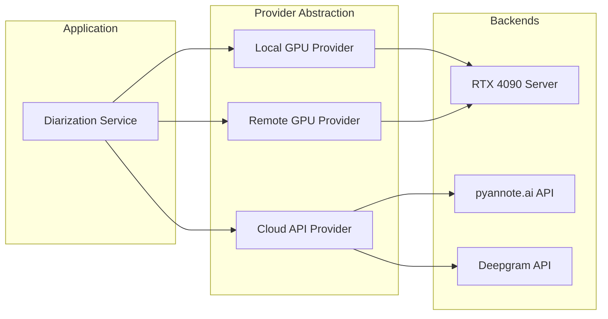
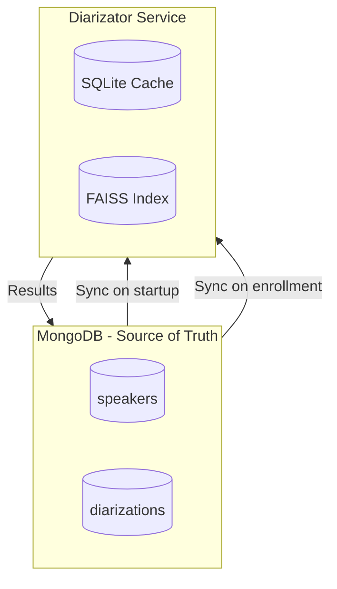
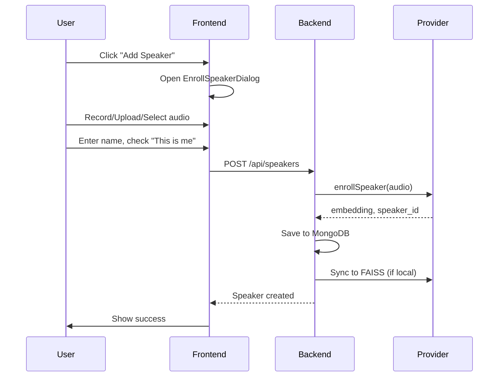

# Speaker Diarization and Voice Identification Implementation Plan

**Status**: Design Document
**Last Updated**: 2026-02-03
**Version**: 1.0

---

## Executive Summary

This document outlines the implementation plan for a complete speaker diarization and voice identification system. The goal is to enable users to:

1. **Identify their own voice** (and other known speakers) across recordings
2. **See speaker labels** in transcripts (not just color dots)
3. **Visualize per-speaker activity** on the timeline
4. **Get real-time speaker feedback** during recording (optional)

---

## Design Decisions Summary

Based on requirements analysis:

| Aspect | Decision |
|--------|----------|
| **Deployment** | Embedded in existing Python worker (not a separate container) |
| **GPU** | Remote RTX 4090 server (via proxy) + Cloud API fallback option |
| **Enrollment** | All options (microphone, file upload, existing segment selection) |
| **Real-time** | Yes, hybrid approach (live preview + batch refinement) |
| **Speakers** | 2-5 people (user + family/colleagues) |
| **Modularity** | Feature flag to enable/disable independently |

---

## Architecture Decisions & Tradeoffs

### Decision 1: Diarization Provider Strategy

**Recommendation: Multi-provider abstraction layer**

Support three providers with automatic fallback:
1. **Local/Remote GPU** (RTX 4090 via existing `gpu/proxy`)
2. **Cloud API** (pyannote.ai or Deepgram)



**Provider comparison:**

| Feature | Local PyAnnote (GPU) | pyannote.ai Cloud | Deepgram |
|---------|---------------------|-------------------|----------|
| Accuracy (DER) | ~11-19% | ~8-14% (Precision-2) | ~15-20% |
| Latency | 2-5s per minute audio | 3-10s API call | 1-3s |
| Cost | GPU electricity | $0.01-0.05/min | $0.01/min |
| Voiceprints | Yes (local storage) | Yes (API managed) | Limited |
| Offline | Yes | No | No |
| Privacy | Full control | Data sent to cloud | Data sent to cloud |

**Recommendation**: Start with Remote GPU (your 4090), add cloud fallback later.

---

### Decision 2: Real-time vs Batch Processing

**Tradeoffs for real-time speaker identification:**

| Latency Target | Approach | Accuracy Impact | Complexity |
|----------------|----------|-----------------|------------|
| < 1 second | DIART streaming (500ms chunks) | -5-10% accuracy | High |
| 2-5 seconds | Chunk-based (5-10s windows) | -2-5% accuracy | Medium |
| 10-30 seconds | Batch processing | Optimal accuracy | Low |

**Recommendation: Hybrid approach**

1. **Real-time preview** (2-5 second chunks): Show provisional speaker identification during recording
2. **Batch refinement** (after recording): Re-process for final accurate labels

This gives you:
- Instant feedback ("You're speaking now")
- High accuracy in final transcript
- Reasonable complexity

**Implementation with DIART library:**
- DIART uses pyannote models for streaming diarization
- Configurable latency: 500ms to 5 seconds
- Supports speaker identification with enrolled voiceprints
- Python library, integrates with existing worker

---

### Decision 3: Storage Architecture

**Current state**: Diarizator uses SQLite for speaker data, app uses MongoDB.

**Recommendation: MongoDB as source of truth with sync to diarizator**



**Why this approach:**
- Single source of truth (MongoDB) - easier backup, migration
- SQLite used only as local cache for fast FAISS operations
- Sync happens: on service startup, on new enrollment, on demand
- If SQLite is lost, rebuild from MongoDB

**Sync implementation:**

```python
# On diarizator startup or via API call
async def sync_speakers_from_mongo():
    # Fetch all speakers from MongoDB
    speakers = await mongo.speakers.find().to_list()

    # Clear local SQLite and FAISS
    sqlite_session.query(Speaker).delete()
    faiss_index.reset()

    # Rebuild from MongoDB
    for speaker in speakers:
        add_to_sqlite(speaker)
        add_to_faiss(speaker.embedding)
```

---

### Decision 4: Feature Flag Implementation

Add to user settings schema:

```typescript
interface UserSettings {
  // ... existing settings
  features: {
    speakerIdentification: {
      enabled: boolean;              // Master toggle
      autoIdentify: boolean;         // Auto-identify during diarization
      realtimePreview: boolean;      // Show real-time speaker during recording
      provider: 'local' | 'remote' | 'cloud';
      cloudProvider?: 'pyannote' | 'deepgram';
      similarityThreshold: number;   // 0.3 - 0.8, default 0.5
    };
  };
}
```

**UI location**: Settings page > Features section

---

## Current State Analysis

### What Already Exists

The codebase has a solid foundation for speaker diarization:

**Backend (diarizator service)**:
- PyAnnote Audio 3.1 pipeline for speaker segmentation
- Speaker embedding extraction using `wespeaker-voxceleb-resnet34-LM` (512-dimensional vectors)
- FAISS index for fast speaker similarity search
- Enrollment API endpoints: `/enroll/upload`, `/enroll/batch`, `/enroll/append`
- Seeded clustering for matching known speakers
- Multi-user support with `user_id` scoping

**GPU Proxy Server** (`gpu/proxy/server.py`):
- Already proxies Whisper and Ollama requests to RTX 4090 server
- API key authentication
- Can be extended for diarization

**Python Workers**:
- VAD processing with Silero
- Diarization worker that groups chunks and calls diarization server
- Results stored in `diarizations` MongoDB collection

**Frontend**:
- Histogram timeline showing diarization density
- Color-coded speaker dots in transcript view (derived from embeddings via PCA)
- Diarization detail page with embedding visualization

### What's Missing

1. **Speaker Management UI** - No way to create/edit/name speakers in the frontend
2. **Voice Enrollment UI** - No interface to record or upload voice samples
3. **Speaker Labels in Transcripts** - Only color dots, no names shown
4. **Per-Speaker Timeline Tracks** - Only aggregate diarization histogram
5. **Automatic Voice Identification** - Diarization runs but doesn't auto-identify enrolled speakers
6. **Real-time Identification** - No streaming diarization during recording
7. **Provider Abstraction** - Hardcoded to local diarizator service
8. **Feature Toggle** - No way to enable/disable speaker features

---

## Implementation Plan

### Phase 0: Feature Flag & Configuration

**0.1 Add Feature Flag to Settings**

Create feature configuration in user settings:
- Enable/disable speaker identification
- Choose provider (local GPU / remote GPU / cloud)
- Set similarity threshold
- Toggle real-time preview

**0.2 Environment Configuration**

```bash
# .env additions
SPEAKER_IDENTIFICATION_ENABLED=true
SPEAKER_PROVIDER=remote  # local | remote | cloud
SPEAKER_REMOTE_GPU_URL=https://your-gpu-server:8000
SPEAKER_CLOUD_PROVIDER=pyannote  # pyannote | deepgram
SPEAKER_CLOUD_API_KEY=xxx
SPEAKER_SIMILARITY_THRESHOLD=0.5
```

---

### Phase 1: Speaker Management Foundation

**1.1 Backend: Speaker Collection & API**

Create `speakers` collection in MongoDB:

```typescript
interface Speaker {
  _id: ObjectId;
  user_id: ObjectId;
  name: string;                    // "Me", "Wife", "Bob"
  external_speaker_id: string;     // ID in diarizator service
  embedding: number[];             // 512-dim vector (synced from diarizator)
  color: string;                   // Hex color for UI
  is_self: boolean;                // True if this is the user's own voice
  enrollment_count: number;        // Number of audio samples used
  total_duration: number;          // Total enrollment audio duration
  average_confidence: number;      // Rolling average identification confidence
  created_at: Date;
  updated_at: Date;
}
```

**1.2 Provider Abstraction Layer**

Create `DiarizationProvider` interface:

```typescript
interface DiarizationProvider {
  name: string;

  // Enrollment
  enrollSpeaker(audio: Buffer, speakerId: string, userId: string): Promise<Embedding>;
  appendEnrollment(audio: Buffer, speakerId: string): Promise<Embedding>;
  deleteSpeaker(speakerId: string): Promise<void>;

  // Diarization
  diarize(audio: Buffer, options: DiarizeOptions): Promise<DiarizationResult>;
  diarizeAndIdentify(audio: Buffer, speakerIds: string[]): Promise<IdentificationResult>;

  // Streaming (for real-time)
  createStream?(options: StreamOptions): DiarizationStream;
}

// Implementations:
class LocalGPUProvider implements DiarizationProvider { ... }
class RemoteGPUProvider implements DiarizationProvider { ... }
class PyannoteCloudProvider implements DiarizationProvider { ... }
class DeepgramProvider implements DiarizationProvider { ... }
```

---

### Phase 2: Voice Enrollment UI

**2.1 Speaker List Page**

Create `SpeakersPage.tsx`:
- List of speakers with color indicator, name, enrollment stats
- "Add Speaker" button
- Edit/delete actions per speaker
- Quick "Enroll My Voice" button (prominent for first-time setup)
- Provider status indicator (which backend is active)

**2.2 Enrollment Dialog**

Three enrollment methods:

1. **Microphone Recording**
   - Real-time waveform visualization
   - Duration guide: "Record 10-30 seconds"
   - Playback before submission

2. **File Upload**
   - Drag-and-drop or file picker
   - Support multiple files (batch enrollment)
   - Audio format validation

3. **Segment Selection** (unique feature)
   - Open timeline picker
   - Select time range where user spoke
   - Use existing audio from recordings

**2.3 Enrollment Workflow**



---

### Phase 3: Automatic Speaker Identification

**3.1 Modify Diarization Worker**

Update diarization flow:
1. Check if speaker identification is enabled
2. Fetch user's enrolled speakers
3. Call `/diarize-and-identify` with speaker IDs
4. Store identified_speaker_id in diarization documents

**3.2 Extended Diarization Schema**

```typescript
interface Diarization {
  _id: ObjectId;
  start: Date;
  end: Date;
  original: ObjectId;
  embedding: number[];
  speaker_label: string;           // "SPEAKER_00" (from pyannote)
  identified_speaker_id?: ObjectId; // Matched speaker
  identified_speaker_name?: string; // Denormalized for quick display
  identification_confidence?: number; // 0-100
  identification_method?: 'auto' | 'manual' | 'realtime';
}
```

---

### Phase 4: Real-time Speaker Identification

**4.1 DIART Integration**

Add streaming diarization using DIART library:

```python
# python/speaker/realtime.py
from diart import SpeakerDiarization
from diart.sources import MicrophoneAudioSource
from diart.inference import StreamingInference

class RealtimeSpeakerIdentifier:
    def __init__(self, enrolled_embeddings: dict):
        self.pipeline = SpeakerDiarization()
        self.enrolled = enrolled_embeddings

    async def process_chunk(self, audio_chunk: bytes) -> dict:
        # Process 2-5 second chunk
        diarization = self.pipeline(audio_chunk)

        # Match against enrolled speakers
        for segment, track, embedding in diarization:
            speaker = self.match_speaker(embedding)
            yield {
                'start': segment.start,
                'end': segment.end,
                'speaker': speaker,
                'confidence': confidence
            }
```

**4.2 WebSocket Streaming**

Add WebSocket endpoint for real-time updates:

```typescript
// Frontend receives real-time speaker updates
ws.onmessage = (event) => {
  const { speaker, start, end, confidence } = JSON.parse(event.data);
  updateCurrentSpeaker(speaker); // Update UI: "You are speaking"
};
```

**4.3 Latency Configuration**

| Mode | Chunk Size | Latency | Use Case |
|------|------------|---------|----------|
| Fast | 2 seconds | ~3s | Live feedback during recording |
| Balanced | 5 seconds | ~6s | Good accuracy with feedback |
| Accurate | 10 seconds | ~12s | Best quality, minimal feedback |

---

### Phase 5: Speaker Labels in Transcripts

**5.1 Enhance Transcript Display**

- Show speaker name next to color dot
- Unknown speakers: "Speaker 1", "Speaker 2" with assign option
- Group consecutive segments by same speaker
- Filter by speaker in sidebar

**5.2 Quick Speaker Assignment**

Click on unknown speaker to:
- Assign to existing speaker
- Create new speaker from this segment
- Re-identify similar segments

---

### Phase 6: Per-Speaker Timeline Visualization

**6.1 Speaker Timeline Tracks**

- Dynamic tracks for each enrolled speaker
- Segments where speaker was identified
- Color matches speaker's color
- Toggle via TrackVisibilityPanel

**6.2 Speaker Activity Stats**

- Speaking time per speaker
- Conversation count
- Time-of-day patterns

---

### Phase 7: Re-identification & Quality

**7.1 Background Re-identification Job**

When new speaker enrolled:
- Scan diarizations without speaker_id
- Match against new speaker embedding
- Update matching segments

**7.2 Enrollment Quality Metrics**

- Minimum duration warning (<5 seconds)
- Suggest adding more samples
- Show average confidence stats

---

## File Structure (Modular Design)

```
backend/
├── app/lib/
│   ├── resources/
│   │   └── speaker.ts           # Speaker CRUD API
│   └── speaker/
│       ├── index.ts             # Feature flag check
│       ├── provider.ts          # Provider abstraction
│       ├── providers/
│       │   ├── local.ts         # Local GPU provider
│       │   ├── remote.ts        # Remote GPU provider
│       │   └── cloud.ts         # Cloud API provider
│       └── sync.ts              # MongoDB <-> Diarizator sync

python/
├── speaker/
│   ├── __init__.py
│   ├── realtime.py              # DIART streaming
│   ├── identification.py        # Speaker matching logic
│   └── providers/
│       ├── base.py              # Abstract provider
│       ├── local.py             # Local diarizator
│       ├── remote.py            # Remote GPU
│       └── cloud.py             # pyannote.ai/Deepgram

frontend/
├── src/
│   ├── pages/
│   │   └── SpeakersPage.tsx     # Speaker management
│   ├── components/
│   │   └── speaker/
│   │       ├── SpeakerList.tsx
│   │       ├── EnrollSpeakerDialog.tsx
│   │       ├── VoiceRecorder.tsx
│       │       ├── SegmentSelector.tsx
│   │       └── SpeakerBadge.tsx # Reusable speaker indicator
│   └── lib/
│       └── speaker/
│           ├── api.ts           # Speaker API client
│           └── realtime.ts      # WebSocket client
```

---

## Best Practices Applied

1. **Voiceprint Quality** (pyannote.ai recommendations)
   - 10-30 seconds of clear speech
   - Single speaker, no overlapping voices
   - Multiple samples via batch/append enrollment

2. **Similarity Threshold**
   - Default: 0.5 (50%)
   - User-adjustable in settings
   - Exclusive matching (one speaker per voiceprint)

3. **Incremental Enrollment**
   - Append enrollment with weighted averaging
   - Quality improves with more samples

4. **Real-time Tradeoffs**
   - Use DIART for streaming (proven library)
   - 2-5 second chunks for balance
   - Batch refinement for final accuracy

5. **Provider Abstraction**
   - Easy to switch between local/remote/cloud
   - Fallback chain if primary fails

---

## Quick Win: Minimum Viable Implementation

For fastest path to "identify my voice":

1. **Feature flag + settings** (0.5 days)
2. **Speakers MongoDB collection + API** (1 day)
3. **Simple enrollment UI with file upload** (1 day)
4. **Modify diarization worker to identify** (1 day)
5. **Show speaker names in transcript** (1 day)

Total: ~4.5 days for basic functionality

Then iterate:
- Add microphone recording
- Add segment selection
- Add real-time streaming
- Add per-speaker timeline

---

## TODOs

- [ ] **Phase 0**: Add speaker identification feature flag to settings
- [ ] **Phase 1**: Create speakers collection and API in backend
- [ ] **Phase 1**: Create DiarizationProvider abstraction layer
- [ ] **Phase 2**: Build SpeakersPage and EnrollSpeakerDialog
- [ ] **Phase 3**: Modify diarization worker to auto-identify speakers
- [ ] **Phase 4**: Implement real-time speaker identification with DIART
- [ ] **Phase 5**: Update TranscriptPage to show speaker names
- [ ] **Phase 6**: Add per-speaker tracks to timeline
- [ ] **Phase 7**: Add background re-identification job

---

**Document Owner**: Development Team
**Review Cycle**: As needed during implementation
