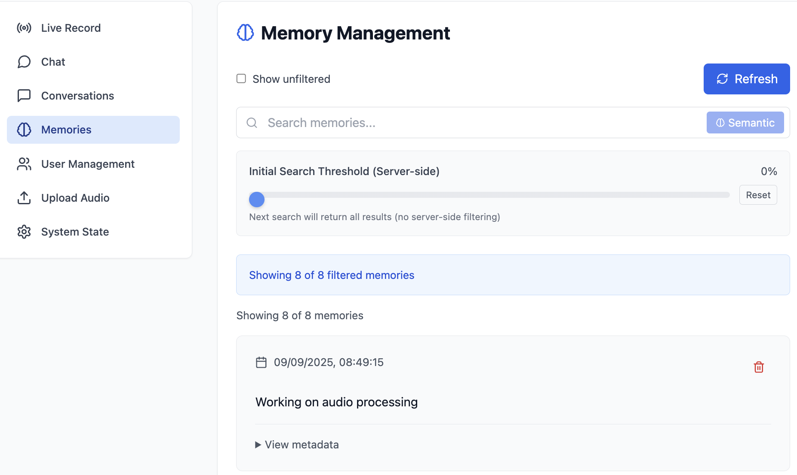

<<<<<<< HEAD
# Mycelia [preview version]

**Mycelia is your self-hosted AI memory and timeline.**

Capture ideas, thoughts, and conversations in **voice, screenshots, or text**.
Ask anything later — _“What did I say about X last May?” Mycelia tells you, in
your own words.

📍 Local-first · 🔓 Open-source · 📦 Modular · 🛠 Hackable

## Roadmap

**Ready to use**

😐 Ingestion pipeline for audio files

😐 Audio chunking

😐 Speech Detection + Transcription

😐 Timeline UI for playback & search

😐 Transcript-synced playback

😐 Modular system (add your own!)

😐 MCP (Model Context Protocol)

😐 OAuth2

😐 Summarizations

😐 Full Text Search

😐 Observability

**In Progress**

🫥 Chat with your memory

🫥 Streaming ingestion (replace batch system)

🫥 Other modalities (health, geolocation, photos, etc.)

🫥 Sharing

🫥 Semantic Search

🫥 Backup Management


## 🚀 Quick Start

### 1. Prerequisites

Install these system dependencies:

**macOS:**
```bash
brew install portaudio deno ffmpeg
curl -LsSf https://astral.sh/uv/install.sh | sh
# Install Docker Desktop: https://www.docker.com/products/docker-desktop
```

**Linux:**
```bash
sudo apt install portaudio19-dev ffmpeg
curl -fsSL https://deno.land/install.sh | sh
curl -LsSf https://astral.sh/uv/install.sh | sh
# Install Docker: https://docs.docker.com/engine/install/
```

**Windows:**
```powershell
# Install Deno
irm https://deno.land/install.ps1 | iex
# Install uv
curl -LsSf https://astral.sh/uv/install.sh | sh
# Install FFmpeg: https://ffmpeg.org/download.html
# Install Docker Desktop: https://www.docker.com/products/docker-desktop
```

### 2. Setup & Run

```bash
# Clone the repo
git clone https://github.com/your-org/mycelia.git
cd mycelia

# Start the services (MongoDB, Redis, Kafka)
docker compose up -d

# Configure environment
cd backend
cp .env.example .env
# Edit .env with your preferred settings

# Generate auth credentials (requires services running)
deno run -A --env server.ts token create
# Copy the printed MYCELIA_TOKEN and MYCELIA_CLIENT_ID into your .env

# Start the backend server
deno task dev
```

The backend will be available at http://localhost:5173/

### 3. Frontend (Optional)

To use the separate frontend application:

```bash
cd frontend
deno task dev
```

The frontend runs on http://localhost:3001/. Configure the backend URL and credentials in the settings page.

## Commands

### Backend Server

```bash
cd backend

# Generate auth tokens (put in .env)
deno run -A --env server.ts token create

# Start the server
deno task dev
```

### Frontend Development

```bash
cd frontend

# Start development server
deno task dev

# Run tests
deno task test

# Type checking
deno task type-check

# Linting
deno lint
```

### Audio Import Setup

1. The `python/settings.py` works out-of-the-box and auto-detects:
   - Apple Voice Memos (if `CloudRecordings.db` exists)
   - Google Drive Easy Voice Recorder (scans `~/Library/CloudStorage/GoogleDrive-*`)
   - Local audio folder (`~/Library/mycelia/audio`)

   Customize paths/timezones via environment variables in `.env`:
   - `MYCELIA_APPLE_VOICEMEMOS_ROOT` - Apple Voice Memos path
   - `MYCELIA_GOOGLE_DRIVE_ROOT` - Google Drive Easy Voice Recorder path
   - `MYCELIA_LOCAL_AUDIO_ROOT` - Local audio folder path
   - `MYCELIA_GOOGLE_TZ` - Timezone for Google Drive timestamps (default: `UTC`)
   - `MYCELIA_LOCAL_TZ` - Timezone for local file timestamps (default: `UTC`)

2. **macOS only**: Grant Full Disk Access to your terminal app (Terminal, iTerm, VS Code, etc.) via System Settings → Privacy & Security → Full Disk Access. Restart the terminal after granting access.

3. Start the daemon, which will automatically import new recordings from your sources in the background.

```bash
# Run recordings import daemon
cd python
uv run daemon.py
```

   **Progress tracking**: The import process shows:
   - Discovery progress bars for each source (e.g., "Discovering apple_voicememos: 45/150 files")
   - Ingestion progress: "Starting ingestion: 23 files pending"
   - Per-file status: "Ingesting [5/23]: /path/to/file.m4a"
   - Batch summary: "Ingestion batch complete: 20 processed, 2 skipped, 1 errors, 3 remaining"

   **Processing frequency**: The daemon runs continuously, processing up to 20 files per batch, then sleeps briefly before the next batch. Failed files are skipped for 2 hours before retry.

   **Resumable**: The daemon tracks already-processed files in the database. If you cancel (Ctrl+C) and restart, it will skip files that were already discovered and continue from where it left off.

   **Logging**: All processing is logged to `~/Library/mycelia/logs/daemon.log` with detailed debug information including full ffmpeg errors. The console shows INFO level messages.

4. After the initial import completes, run the `Recalculate timeline histograms` command below.

#### Troubleshooting Import Issues

**FFmpeg errors**: If you see "ffmpeg error (see stderr output for detail)":
1. Check `~/Library/mycelia/logs/daemon.log` for the full error message
2. Common causes:
   - Corrupted audio file (try playing it in another app)
   - Unsupported codec (ffmpeg may need additional codecs)
   - File permission issues (verify Full Disk Access is granted)
3. Files with errors are automatically retried after 2 hours
4. To force immediate retry, remove the error from MongoDB or wait for the retry window


### Speech-to-Text (STT)

**Prerequisites:** Ensure you've installed PortAudio as described in [python/README.md](python/README.md#portaudio-required-for-sttpy).

Configure and run the STT processor:

- Run python/whisper_server/server.py on a gpu machine and set the `STT_SERVER_URL` in .env
- Run `uv run stt.py` to process the audio chunks


### Remote Operations (cli.ts)

For operations against a remote server (requires login & API key), from /backend directory:

```bash
# Login to remote server
cd backend
deno run --env -E='MYCELIA_*' --allow-net cli.ts login

# Import audio file to remote server
deno run --env -E='MYCELIA_*' --allow-net cli.ts audio import /path/to/file.wav

# Timeline operations via MCP

# Mark timeline data as stale
deno run --env -E='MYCELIA_*' --allow-net cli.ts mcp call tech.mycelia.timeline -a '{"action": "invalidate", "start": "10d"}'

# Recalculate timeline histograms
deno run --env -E='MYCELIA_*' --allow-net cli.ts mcp call tech.mycelia.timeline -a '{"action": "recalculate", "all": true}'

# Ensure timeline indexes
deno run --env -E='MYCELIA_*' --allow-net cli.ts mcp call tech.mycelia.timeline -a '{"action": "ensureIndex"}'

# MongoDB operations via MCP
# Find documents
deno run --env -E='MYCELIA_*' --allow-net cli.ts mcp call tech.mycelia.mongo -a '{"action": "find", "collection": "audio_chunks", "query": {}, "options": {"limit": 10}}'

# Count documents
deno run --env -E='MYCELIA_*' --allow-net cli.ts mcp call tech.mycelia.mongo -a '{"action": "count", "collection": "transcriptions", "query": {}}'

# Redis operations via MCP
# Get value
deno run --env -E='MYCELIA_*' --allow-net cli.ts mcp call tech.mycelia.redis -a '{"action": "get", "key": "some-key"}'

# Set value
deno run --env -E='MYCELIA_*' --allow-net cli.ts mcp call tech.mycelia.redis -a '{"action": "set", "key": "some-key", "value": "some-value"}'

# GridFS operations via MCP
# Find files
deno run --env -E='MYCELIA_*' --allow-net cli.ts mcp call tech.mycelia.fs -a '{"action": "find", "bucket": "uploads", "query": {}}'
```

## Contributing

You’re welcome to fork, build plugins, suggest features, or break things
(metaphorically, c'mon, it's open source).

- Join the [Discord](https://discord.gg/hPfYbpp2am)
- PRs are welcome

## License

[MIT](./LICENSE)
=======
# Friend-Lite

Self-hostable AI system that captures audio/video data from OMI devices and other sources to generate memories, action items, and contextual insights about your conversations and daily interactions.

## Quick Start → [Get Started](quickstart.md)

Clone, run setup wizard, start services, access at http://localhost:5173

## Screenshots

### WebUI Dashboard


### Memory Search



*[Mobile App - Screenshot coming soon]*


## What's Included

- **Mobile app** for OMI devices via Bluetooth
- **Backend services** (simple → advanced with full AI features)
- **Web dashboard** for conversation and memory management
- **Optional services**: Speaker recognition, offline ASR, distributed deployment

## Links

- **📚 [Setup Guide](quickstart.md)** - Start here
- **🔧 [Full Documentation](CLAUDE.md)** - Comprehensive reference
- **🏗️ [Architecture Details](Docs/features.md)** - Technical deep dive
- **🐳 [Docker/K8s](README-K8S.md)** - Container deployment

## Vision

This fits as a small part of the larger idea of "Have various sensors feeding the state of YOUR world to computers/AI and get some use out of it"

Usecases are numerous - OMI Mentor is one of them. Friend/Omi/pendants are a small but important part of this, since they record personal spoken context the best. OMI-like devices with a camera can also capture visual context - or smart glasses - which also double as a display.

Regardless - this repo will try to do the minimal of this - multiple OMI-like audio devices feeding audio data - and from it:
- Memories
- Action items  
- Home automation

## Golden Goals (Not Yet Achieved)

- **Action items detection** (partial implementation)
- **Home automation integration** (planned)
- **Multi-device coordination** (planned)
- **Visual context capture** (smart glasses integration planned)

>>>>>>> friend/main
